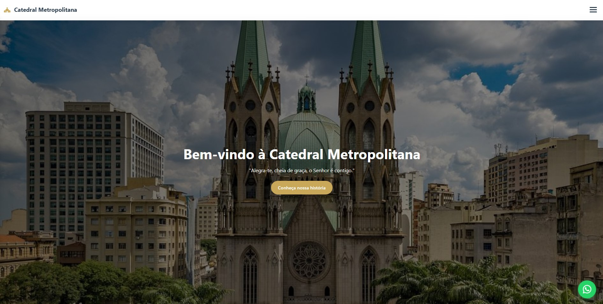

# ⛪ Catedral Metropolitana - WebSite e Sistema Administrativo


## 📸 Preview do Projeto 

### 🖥️ Site Principal

<p align="center">
  
  <br>
  <em>Página inicial da Catedral Metropolitana - Versão Desktop</em>
</p>

## 🛠️ Tecnologias Utilizadas

<div align="center">

### Frontend


### Bibliotecas e APIs


### Armazenamento


### Ferramentas


</div>

---

## 📖 Sobre o Projeto 
Site completo para a Catedral Metropolitana Nossa Senhora da Assunção (Catedral da Sé), desenvolvido com foco em **experiência do usuário**, **acessibilidade** e **facilidade de gestão** de conteúdo.

### 📀 Funcionalidades Principais 
| Área | Descrição |
|------|-----------|
| **Liturgia Diária** | Leituras, evangelho, santo do dia e reflexões com navegação por datas |
| **Transmissão ao Vivo** | Player integrado do YouTube para missas e eventos |
| **Confessionário Virtual** | Agendamento de confissões com horários disponíveis |
| **Doações via PIX** | Geração de QR Code dinâmico com valores sugeridos |
| **Galeria de Fotos** | Lightbox interativo para imagens da catedral |
| **Notícias** | Artigos completos com compartilhamento no WhatsApp |
| **Contato** | Formulário integrado com Formspree |
| **Mapa de Localização** | Google Maps integrado + informações de como chegar |
| **WhatsApp Flutuante** | Botão com tooltip animado para contato rápido |

---

## 👨‍💻 Área Administraativa

### 🔐 Acesso ao Painel

| Credencial | Valor |
|------------|-------|
| **Login** | `admin@catedral.com` |
| **Senha** | `admin123` |

> ⚠️ *Para produção, altere estas credenciais no arquivo `admin/js/auth.js`*

### 📋 Funcionalidades do Admin

| Módulo | O que pode fazer |
|--------|------------------|
| **Notícias** | Criar, editar, publicar/rascunho, excluir notícias completas |
| **Confissões** | Visualizar agendamentos, confirmar, cancelar, excluir registros |
| **Mensagens** | Ler mensagens do formulário de contato, marcar como lidas, excluir |
| **Doações** | Visualizar histórico de doações (simulado) |
| **Dashboard** | Visão geral com estatísticas e últimas notícias |

## 📁 Estrutura de Arquivos do Admin

```text
admin/
├── index.html        # Tela de login
├── dashboard.html    # Painel principal
├── css/
│   └── admin.css     # Estilos do admin
├── js/
│   ├── auth.js       # Autenticação e logout
│   ├── dashboard.js  # Navegação e estatísticas
│   ├── noticias.js   # CRUD de notícias
│   ├── confissoes.js # Gerenciamento de confissões
│   ├── contato.js    # Leitura de mensagens
│   └── doacoes.js    # Histórico de doações
```
---

## 🚀 Como Executar 

Pré-requisitos

- Navegador moderno (chrome, Firefox, Edge, Safari)
- Servidor local (opcional - pdoe abrir direto no navegador)

---

### Passo a Passo 
1. **Clone o repositório**
   ```bash
   git clone https://github.com/seu-usuario/catedral-metropolitana.git
   cd catedral-metropolitana

  ## 2. Estrutura de pastas esperada

```text
projeto/
├── index.html          # Página principal do site
├── assets/
│   ├── css/
│   │   └── style.css   # Estilos do site
│   ├── js/
│   │   └── script.js   # JavaScript do site
│   └── img/            # Imagens da catedral
└── admin/              # Painel administrativo
```

### 3. Abra o site

- Navegue até a pasta do projeto 
- Abra **index,html** em seu navegador 
- Ou use um servidor local (Live Server do VS Code, por exemplo)

### 4. Acesse o Admin
- Abre admin/index.html
- Use aas crenciaais acima

---

## 📱 Responsividade

| Dispositivo | Breakpoint | Características |
|------------|-----------|------------------- |
| Mobile | < 480px | Menu Haambúguer, texto ajustado, botóes expeandidos|
| Tablet | 480px - 768px | Grid de 2 colunas, espaaçamento ajustado |
| DeskTop | > 768px | Layout completo, grid de 4 colunas, hover effects|

---

### Otimizaação Específicas para Android/iOS
 - -webkit-tap-highlight-color: transparent - Remove highlight no toque
 - font-size: 16px em inputs - Previne zoom automático
 - scroll-behavior: smooth - Scroll suave
 - -webkit-overflow-scrolling: touch - Scroll fluido
 - Redução de animações para quem prefere prefers-reduced-motion
---

 ##  🗄️ Estrutura de Dados (LocalStorage)

| Chave | Conteúdo | 
|------------|-----------|
| admin_noticias | Notícias cadastradas no admin | 
| site_noticias | Notícias publicadas (sincronizadas) | 
| confessionario_agendamentos | Agendamentos de confissão | 
| admin_mensagens             | Mensagens do formulário de contato |
| admin_doacoes               | Histórico de doações               |
| admin_logged                | Sessão do administrador |

---
